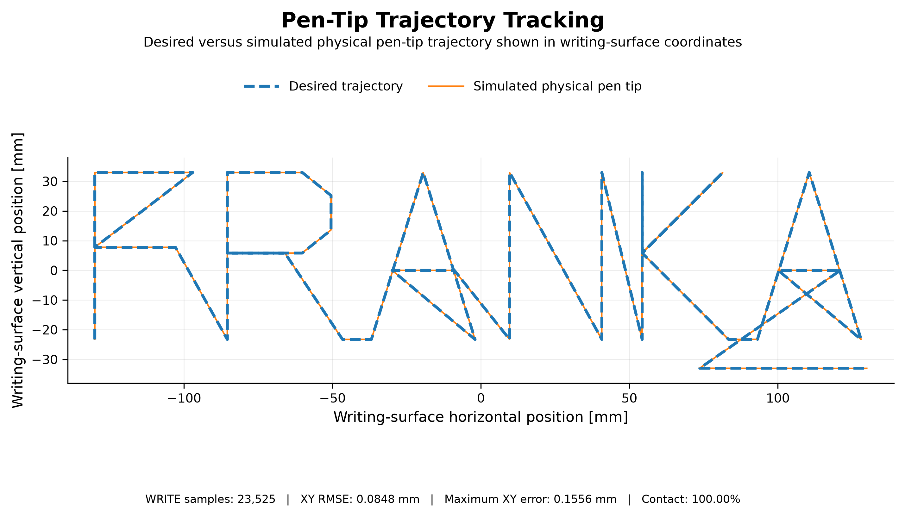
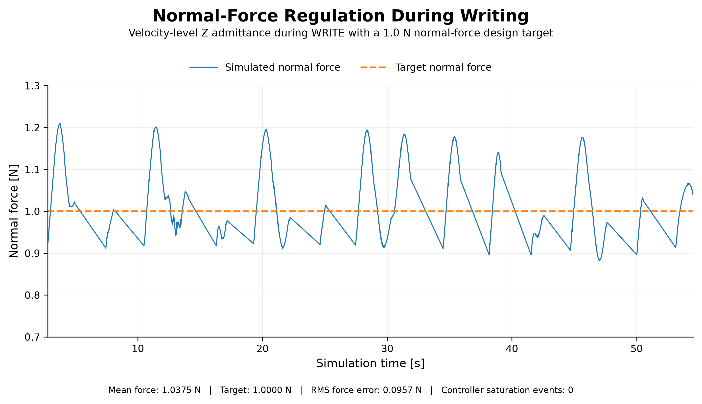
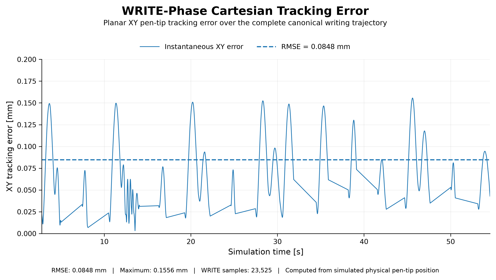
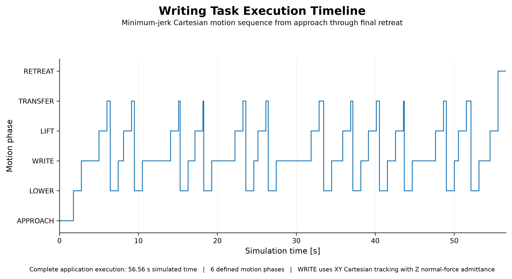

# Franka Writing Studio — Physics-Based Robotics Digital Twin

[](https://github.com/Devansh-Mishra-30/franka-writing-studio/actions/workflows/ci.yml)
[](LICENSE)
[](Dockerfile)

## Overview

Franka Writing Studio is a simulation-only robotics application for a 7-DoF Franka robot. It converts supported SVG path geometry into Cartesian waypoints, constructs a complete pen-lift/write/transfer trajectory, validates the motion against the modeled workcell, and executes it in PyBullet.

During writing, the controller combines Cartesian XY path tracking, Z-axis normal-force velocity admittance, and orientation hold. Damped least-squares differential inverse kinematics maps the Cartesian command to bounded joint-velocity commands.

The project also includes Pinocchio rigid-body dynamics, MATLAB cross-software verification, a controlled synthetic model-mismatch experiment, residual learning, a PySide6 command center, automated tests, Docker reproducibility, and GitHub Actions CI.

> This repository demonstrates simulation, controls, software architecture, and verification. It has not been deployed on a physical Franka and is not a safety-certified robot controller.

## Demo

Launch the interactive command center:

```bash
./wr build
./wr ui
```

Select an SVG, enable the PyBullet window, and choose **RUN LIVE**.

Run the headless acceptance cycle:

```bash
./wr e2e
```

## Validated Results

Canonical release experiment:

- SVG: `svg/franka_portfolio.svg`
- Git commit: `a12ad83d0ca8784b6059cd63f59b7ac2044c00ba`
- Environment state: clean
- Simulation timestep: 1 ms
- Complete plan: home, approach, write, transfer, retract, and return

| Metric | Result |
|---|---:|
| WRITE samples | 23,525 |
| WRITE contact rate | 100.00% |
| WRITE XY RMSE | 0.0848 mm |
| WRITE maximum XY error | 0.1556 mm |
| Mean normal force | 1.0375 N |
| Target normal force | 1.0000 N |
| Force RMS error | 0.0957 N |
| Force-control saturation count | 0 |
| Simulated steps | 56,560 |
| Wall-clock execution | 22.67 s |
| Real-time factor | 2.49× |

These are deterministic simulation results, not physical-robot accuracy claims.









## System Architecture

```text
SVG input
   │
   ▼
SVG waypoint source ──► scale and place in notebook frame
   │
   ▼
TimedWritingPlan ──► minimum-jerk approach/write/transfer/retract segments
   │
   ▼
Workcell validation ──► bounds, reachability, sampled collision preflight
   │
   ▼
RobotInterface ──► commands, lifecycle state, faults, cancellation
   │
   ▼
Hybrid Cartesian controller
   ├── XY position tracking
   ├── Z normal-force velocity admittance
   └── orientation hold
   │
   ▼
Damped least-squares differential IK
   │
   ▼
PyBulletAdapter ──► Franka simulation, contact, telemetry, artifacts
```

Primary boundaries:

- `robot/`: commands, application state, status, faults, and public robot interface
- `tasks/`: writing-task planning, validation, execution, and cancellation
- `workcells/`: notebook, table, tools, workspace, and collision preflight
- `simulation/`: PyBullet-specific implementation
- `ui/`: PySide6 command center and experiment worker
- `verification/`: Pinocchio/MATLAB and model-mismatch workflows
- `learning/`: offline residual-model training and evaluation
- `tests/`: numerical, unit, component, and lifecycle tests

## Documentation

- [System architecture](docs/architecture.md)
- [Robot task interface](docs/robot_task_interface.md)
- [Validation and reproducibility](docs/validation.md)

## Writing Pipeline

1. Read supported SVG path data.
2. Convert path endpoints into Cartesian source waypoints.
3. Scale and center the geometry inside the notebook work area.
4. Add pen-lift, approach, transfer, and retract motion.
5. Create minimum-jerk Cartesian segments.
6. Validate workcell bounds and sampled reachability.
7. Perform sampled robot-table collision preflight.
8. Home the simulated robot and execute the writing plan.
9. Record telemetry, metrics, configuration, and provenance.
10. Return the application to `READY`.

## Kinematics and Differential IK

The official Franka URDF is pinned as a Git submodule. Pinocchio supplies forward kinematics, frame Jacobians, and rigid-body dynamics.

The motion controller uses damped least-squares differential inverse kinematics:

$$
\dot{q}=J^{T}(JJ^{T}+\lambda^{2}I)^{-1}v
$$

The implementation applies official joint-position and joint-velocity limits and holds the selected tool orientation while tracking the pen-tip reference.

## Trajectory Generation

SVG processing produces source waypoints. `TimedWritingPlan` converts those waypoints into the executed trajectory. Each segment uses minimum-jerk interpolation:

$$
s(\tau)=10\tau^3-15\tau^4+6\tau^5,\qquad 0\leq\tau\leq1
$$

Segment durations are determined from Cartesian distance, configured speed, and a minimum-duration bound.

## Hybrid Position / Force Control

The accurate controller description is:

> XY Cartesian position tracking, Z normal-force velocity admittance during writing, and orientation hold, mapped through damped least-squares IK to bounded joint-velocity commands.

The force loop adjusts commanded vertical velocity using normal-force error. It is velocity-level admittance control, not torque-level impedance control.

## Rigid-Body Dynamics

Pinocchio computes forward kinematics, frame Jacobians, the joint-space mass matrix, velocity-product effects, gravity torque, and recursive Newton–Euler inverse dynamics. These quantities support verification and offline modeling experiments; the active PyBullet writing controller is velocity-command based.

## Verification and Validation

The project includes:

- Jacobian finite-difference checks
- Pinocchio–PyBullet frame agreement
- Pinocchio internal inverse-dynamics reconstruction
- Independent MATLAB Robotics System Toolbox comparison
- Workcell bounds and sampled reachability validation
- Sampled robot–table collision preflight
- Application lifecycle, STOP, fault, and RESET tests
- Quantitative end-to-end acceptance testing
- GitHub Actions CI using the Docker environment

Across 10 seeded states, maximum Pinocchio–MATLAB differences were:

| Quantity | Maximum difference |
|---|---:|
| FK position | $1.36\times10^{-16}$ m |
| FK rotation | $2.11\times10^{-8}$ rad |
| Jacobian | $1.36\times10^{-15}$ Frobenius norm |
| Mass matrix | $1.25\times10^{-15}$ Frobenius norm |
| Velocity-product torque | $8.20\times10^{-15}$ N·m |
| Gravity torque | $9.24\times10^{-15}$ N·m |
| Inverse dynamics | $9.66\times10^{-15}$ N·m |

This verifies cross-library implementation and convention agreement using the same URDF; it does not establish physical-model accuracy.

## Model Mismatch and Residual Learning

A controlled offline experiment perturbs the modeled mass and rotational inertia associated with joint 4 by 15%. A multivariate ridge model trained on 5,000 seeded states and 176 nonlinear dynamics-inspired features was evaluated on a separate writing trajectory:

| Metric | Result |
|---|---:|
| Physics-only residual RMS norm | 0.294519 N·m |
| Hybrid residual RMS norm | 0.073457 N·m |
| Reduction | 75.06% |

This is an offline synthetic mismatch-correction experiment. It is not physical system identification, deep learning, online adaptation, or a deployed controller.

## Robot Application Interface

Commands:

- `HOME`
- `START_WRITING`
- `STOP`
- `RESET`

Nominal lifecycle:

```text
INIT → HOMING → READY → PLANNING → VALIDATING → EXECUTING → COMPLETE
                                              └───────────→ STOPPED / FAULT
```

The interface provides state, task status, progress, fault information, telemetry, cooperative cancellation, and reset behavior. It is structured for future ROS 2 and PLC adapters; neither adapter is included in this release.

## Testing

```bash
./wr doctor
./wr audit
./wr test
./wr e2e
```

Current release gate: **129 tests passing**.

GitHub Actions checks out the pinned submodule, builds the Docker image, and runs the pytest suite for pushes and pull requests.

## Quick Start

Requirements: Git, Docker, and WSLg or an X server for the GUI.

```bash
git clone --recurse-submodules \
  https://github.com/Devansh-Mishra-30/franka-writing-studio.git
cd Writing_robot_with_vid

./wr build
./wr doctor
./wr test
./wr e2e
./wr ui
```

Available commands:

```text
./wr build
./wr rebuild
./wr test
./wr e2e
./wr shell
./wr ui
./wr phase4
./wr phase5
./wr phase6
./wr doctor
./wr audit
./wr clean
./wr status
```

MATLAB verification requires a compatible MATLAB installation with Robotics System Toolbox.

## Repository Structure

```text
config/          Release configuration
docs/            Validation documentation and media
experiments/     Writing experiment orchestration
learning/        Offline residual learning
robot/           Robot application interface
scripts/         Acceptance and result-generation tools
simulation/      PyBullet implementation
svg/             Release SVG inputs
tasks/           Application tasks
tests/           Automated test suite
third_party/     Pinned Franka-description submodule
tools/           Tool abstractions
ui/              PySide6 command center
urdfs/           Simulation-ready robot/tool models
verification/    Cross-software and mismatch verification
workcells/       Writing-cell model and validation
```

## Limitations

- Simulation only; no physical Franka deployment
- No ROS 2 or PLC integration in this release
- No safety PLC, certified E-stop chain, guarding, or safety validation
- No camera, perception, TCP calibration, or work-object registration
- Pen is rigidly attached; autonomous pickup and return are not implemented
- Collision preflight is sampled and focused primarily on robot–table collision
- No general motion planner or continuous collision checking
- SVG support uses the repository's legacy path parser and is not arbitrary SVG compatibility
- Residual learning is offline and is not part of active control

## Future Work

1. Expose writing through a ROS 2 action.
2. Add HOME and RESET services and a status topic.
3. Preserve cancellation and fault semantics across ROS 2.
4. Add a simulated PLC handshake with command IDs, acknowledgements, heartbeat, `Ready/Busy/Done/Fault`, and communication-loss behavior.
5. Validate the complete ROS 2–PLC sequence with fault injection.

## License

Released under the [MIT License](LICENSE).
